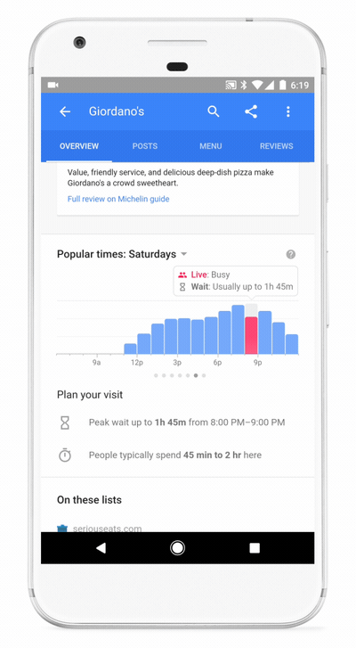
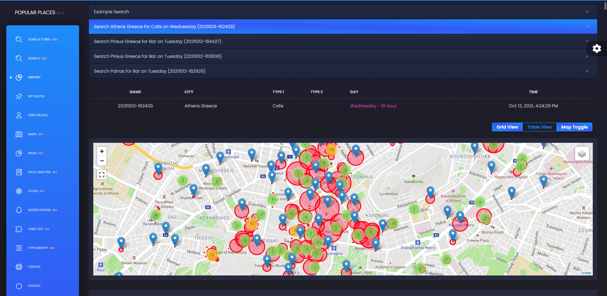

# Popular Places

A Powerful Tool for Live Crowd and Traffic Data.

This application gives you the ability to search Google's [popular times](https://support.google.com/business/answer/6263531) information, particularly popularity and crowd traffic information. Any type of place can be used including shops, establishments and prominent points of interest.

[](media/documentation.gif)

It utilizes a set of Geocoder APIs in order to perform the search, while being able to provide both place and time-based live crowd data. Example: Find out how busy your favorite bars are...

[](media/history_main.png)


## Getting Started

* [Basic Modules](#basic-modules)
* [Interpretability](#interpretability)
* [Dependencies](#dependencies)
* [Running the Model](#running-the-model)
* [Implementation Details](#implementation-details)
  * [HMM Algorithms](#HMM-Algorithms)
  * [Categorization of HMM Models](#Categorization-of-HMM-Models-with-emphasis-on-Classification-Tasks)
  * [Coding Notes - Overall](#Coding-Notes---Overall)
  * [Coding Notes - Pomegranate](#Coding-Notes---Pomegranate)
  * [Coding Notes - Matlab](#Coding-Notes---Matlab)
  * [Coding Notes - HOHMM](#Coding-Notes---HOHMM)
  * [Experiment Notes](#Experiment-Notes)
  * [Random Notes](#Random-Notes)
  * [To Do - Future Work](#To-Do---Future-Work)
* [Citation](#citation)
* [Credits](#credits)


**Flask Black Dashboard** is an open-source [Flask Dashboard](https://appseed.us/admin-dashboards/flask) generated by AppSeed on top of a modern dark-themed UI. 
**Black Dashboard** is a beautiful Bootstrap 4 Admin Dashboard with a huge number of components built to fit together and look amazing. It combines colors that are easy on the eye, spacious cards, beautiful typography, and graphics. For newcomers, 
**Flask** is a lightweight web application framework written in Python that provides a lightweight codebase and libraries that can be easily extended to complex projects. 

> Features

- DBMS: SQLite, PostgreSQL (production) 
- DB Tools: SQLAlchemy ORM, Flask-Migrate (schema migrations)
- Modular design with **Blueprints**, simple codebase
- Session-Based authentication (via **flask_login**), Forms validation
- Deployment scripts: Docker, Gunicorn / Nginx, Heroku 
- Support via **Github** and [Discord](https://discord.gg/fZC6hup).

## How to use it

```bash
$ # Get the code
$ git clone https://github.com/app-generator/flask-black-dashboard.git
$ cd flask-black-dashboard
$
$ # Virtualenv modules installation (Unix based systems)
$ virtualenv env
$ source env/bin/activate
$
$ # Virtualenv modules installation (Windows based systems)
$ # virtualenv env
$ # .\env\Scripts\activate
$
$ # Install modules - SQLite Database
$ pip3 install -r requirements.txt
$
$ # OR with PostgreSQL connector
$ # pip install -r requirements-pgsql.txt
$
$ # Set the FLASK_APP environment variable
$ (Unix/Mac) export FLASK_APP=run.py
$ (Windows) set FLASK_APP=run.py
$ (Powershell) $env:FLASK_APP = ".\run.py"
$
$ # Set up the DEBUG environment
$ # (Unix/Mac) export FLASK_ENV=development
$ # (Windows) set FLASK_ENV=development
$ # (Powershell) $env:FLASK_ENV = "development"
$
$ # Start the application (development mode)
$ # --host=0.0.0.0 - expose the app on all network interfaces (default 127.0.0.1)
$ # --port=5000    - specify the app port (default 5000)  
$ flask run --host=0.0.0.0 --port=5000
$
$ # Access the dashboard in browser: http://127.0.0.1:5000/
```

> Note: To use the app, please access the registration page and create a new user. After authentication, the app will unlock the private pages.

<br />

## Codebase structure

The project is coded using blueprints, app factory pattern, dual configuration profile (development and production) and an intuitive structure presented bellow:

> Simplified version

```bash
< PROJECT ROOT >
   |
   |-- app/                      # Implements app logic
   |    |-- base/                # Base Blueprint - handles the authentication
   |    |-- home/                # Home Blueprint - serve UI Kit pages
   |    |
   |   __init__.py               # Initialize the app
   |
   |-- requirements.txt          # Development modules - SQLite storage
   |-- requirements-mysql.txt    # Production modules  - Mysql DMBS
   |-- requirements-pqsql.txt    # Production modules  - PostgreSql DMBS
   |
   |-- .env                      # Inject Configuration via Environment
   |-- config.py                 # Set up the app
   |-- run.py                    # Start the app - WSGI gateway
   |
   |-- ************************************************************************
```

<br />

> The bootstrap flow

- `run.py` loads the `.env` file
- Initialize the app using the specified profile: *Debug* or *Production*
  - If env.DEBUG is set to *True* the SQLite storage is used
  - If env.DEBUG is set to *False* the specified DB driver is used (MySql, PostgreSQL)
- Call the app factory method `create_app` defined in app/__init__.py
- Redirect the guest users to Login page
- Unlock the pages served by *home* blueprint for authenticated users

<br />

> App / Base Blueprint

The *Base* blueprint handles the authentication (routes and forms) and assets management. The structure is presented below:

```bash
< PROJECT ROOT >
   |
   |-- app/
   |    |-- home/                                # Home Blueprint - serve app pages (private area)
   |    |-- base/                                # Base Blueprint - handles the authentication
   |         |-- static/
   |         |    |-- <css, JS, images>          # CSS files, Javascripts files
   |         |
   |         |-- templates/                      # Templates used to render pages
   |              |
   |              |-- includes/                  #
   |              |    |-- navigation.html       # Top menu component
   |              |    |-- sidebar.html          # Sidebar component
   |              |    |-- footer.html           # App Footer
   |              |    |-- scripts.html          # Scripts common to all pages
   |              |
   |              |-- layouts/                   # Master pages
   |              |    |-- base-fullscreen.html  # Used by Authentication pages
   |              |    |-- base.html             # Used by common pages
   |              |
   |              |-- accounts/                  # Authentication pages
   |                   |-- login.html            # Login page
   |                   |-- register.html         # Registration page
   |
   |-- requirements.txt                          # Development modules - SQLite storage
   |-- requirements-mysql.txt                    # Production modules  - Mysql DMBS
   |-- requirements-pqsql.txt                    # Production modules  - PostgreSql DMBS
   |
   |-- .env                                      # Inject Configuration via Environment
   |-- config.py                                 # Set up the app
   |-- run.py                                    # Start the app - WSGI gateway
   |
   |-- ************************************************************************
```

<br />

> App / Home Blueprint

The *Home* blueprint handles UI Kit pages for authenticated users. This is the private zone of the app - the structure is presented below:

```bash
< PROJECT ROOT >
   |
   |-- app/
   |    |-- base/                     # Base Blueprint - handles the authentication
   |    |-- home/                     # Home Blueprint - serve app pages (private area)
   |         |
   |         |-- templates/           # UI Kit Pages
   |              |
   |              |-- index.html      # Default page
   |              |-- page-404.html   # Error 404 - mandatory page
   |              |-- page-500.html   # Error 500 - mandatory page
   |              |-- page-403.html   # Error 403 - mandatory page
   |              |-- *.html          # All other HTML pages
   |
   |-- requirements.txt               # Development modules - SQLite storage
   |-- requirements-mysql.txt         # Production modules  - Mysql DMBS
   |-- requirements-pqsql.txt         # Production modules  - PostgreSql DMBS
   |
   |-- .env                           # Inject Configuration via Environment
   |-- config.py                      # Set up the app
   |-- run.py                         # Start the app - WSGI gateway
   |
   |-- ************************************************************************
```

<br />

## Deployment

The app is provided with a basic configuration to be executed in [Docker](https://www.docker.com/), [Heroku](https://www.heroku.com/), [Gunicorn](https://gunicorn.org/), and [Waitress](https://docs.pylonsproject.org/projects/waitress/en/stable/).

<br />

### [Docker](https://www.docker.com/) execution
---

The application can be easily executed in a docker container. The steps:

> Get the code

```bash
$ git clone https://github.com/app-generator/flask-black-dashboard.git
$ cd flask-black-dashboard
```

> Start the app in Docker

```bash
$ sudo docker-compose pull && sudo docker-compose build && sudo docker-compose up -d
```

Visit `http://localhost:5005` in your browser. The app should be up & running.

<br />

### [Heroku](https://www.heroku.com/)
---

https://devcenter.heroku.com/articles/python-gunicorn

Steps to deploy on **Heroku**

- [Create a FREE account](https://signup.heroku.com/) on Heroku platform
- [Install the Heroku CLI](https://devcenter.heroku.com/articles/getting-started-with-python#set-up) that match your OS: Mac, Unix or Windows
- Open a terminal window and authenticate via `heroku login` command
- Clone the sources and push the project for LIVE deployment

```bash
$ # Clone the source code:
$ git clone https://github.com/app-generator/flask-black-dashboard.git
$ cd flask-black-dashboard
$
$ # Check Heroku CLI is installed
$ heroku -v
heroku/7.25.0 win32-x64 node-v12.13.0 # <-- All good
$
$ # Check Heroku CLI is installed
$ heroku login
$ # this commaond will open a browser window - click the login button (in browser)
$
$ # Create the Heroku project
$ heroku create
$
$ # Trigger the LIVE deploy
$ git push heroku master
$
$ # Open the LIVE app in browser
$ heroku open
```

<br />

### [Gunicorn](https://gunicorn.org/)
---

Gunicorn 'Green Unicorn' is a Python WSGI HTTP Server for UNIX.

> Install using pip

```bash
$ pip install gunicorn
```
> Start the app using gunicorn binary

```bash
$ gunicorn --bind 0.0.0.0:8001 run:app
Serving on http://localhost:8001
```

Visit `http://localhost:8001` in your browser. The app should be up & running.

<br />

### [Waitress](https://docs.pylonsproject.org/projects/waitress/en/stable/)
---

Waitress (Gunicorn equivalent for Windows) is meant to be a production-quality pure-Python WSGI server with very acceptable performance. It has no dependencies except ones that live in the Python standard library.

> Install using pip

```bash
$ pip install waitress
```
> Start the app using [waitress-serve](https://docs.pylonsproject.org/projects/waitress/en/stable/runner.html)

```bash
$ waitress-serve --port=8001 run:app
Serving on http://localhost:8001
```

Visit `http://localhost:8001` in your browser. The app should be up & running.

<br />

## Credits

- [Spyridon Kardakis](https://www.linkedin.com/in/kardakis/)
- [Flask Framework](https://www.palletsprojects.com/p/flask/)
- [Creative Tim](https://bit.ly/3fKQZaL)
- [AppSeed](https://github.com/app-generator/boilerplate-code)
- [m-wrzr](https://github.com/m-wrzr)

<br />